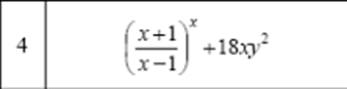

# Task 1
Write code to implement the function for the given variant.

# Task 2
When calculating the value of a function, provide a message indicating which branch was used to calculate the function argument x.
**Option 4** 
Given an integer in the range 1–5, output a string – a verbal description of the corresponding grade (1 – "poor," 2 – "unsatisfactory," 3 – "satisfactory," 4 – "good," 5 – "excellent").
y=cos^3x^2+sin^2x^3, where x={z^3+0.2, for z<1; z+ln z, for z≥1}
# Task 3
Given a natural number N, calculate.
